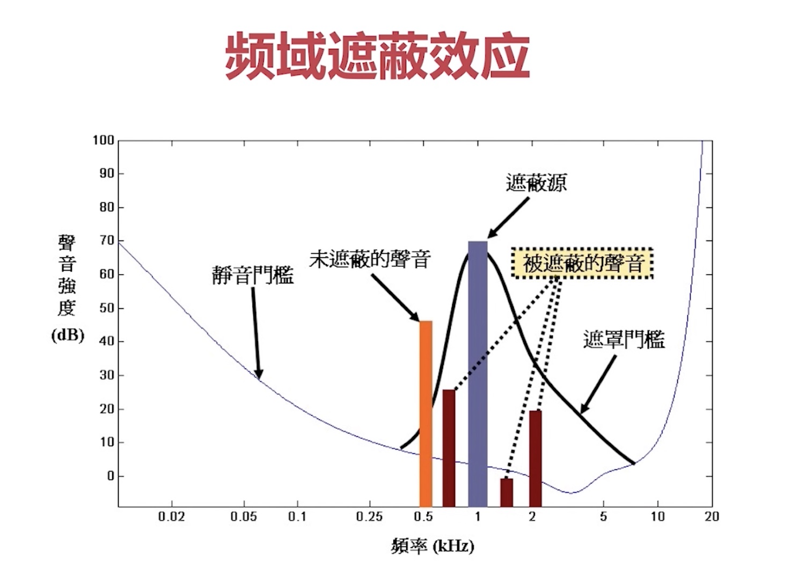
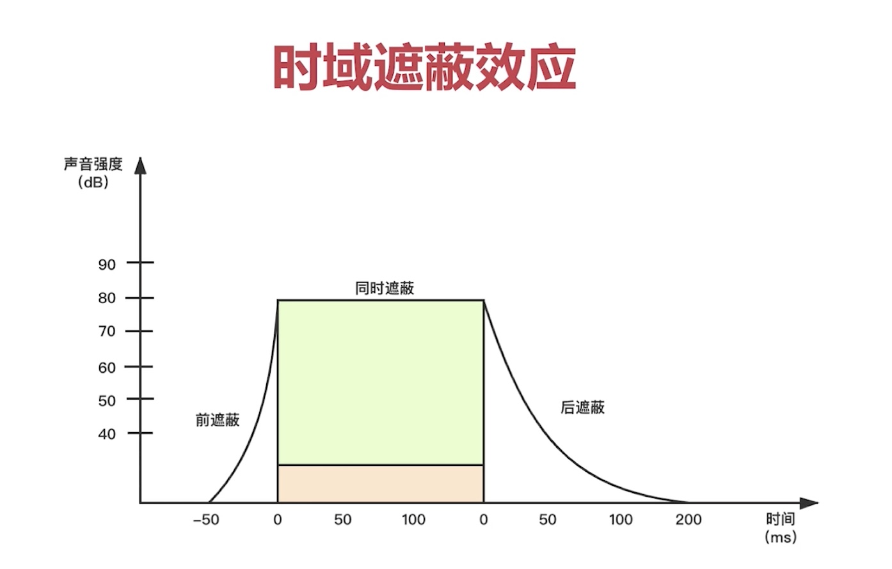
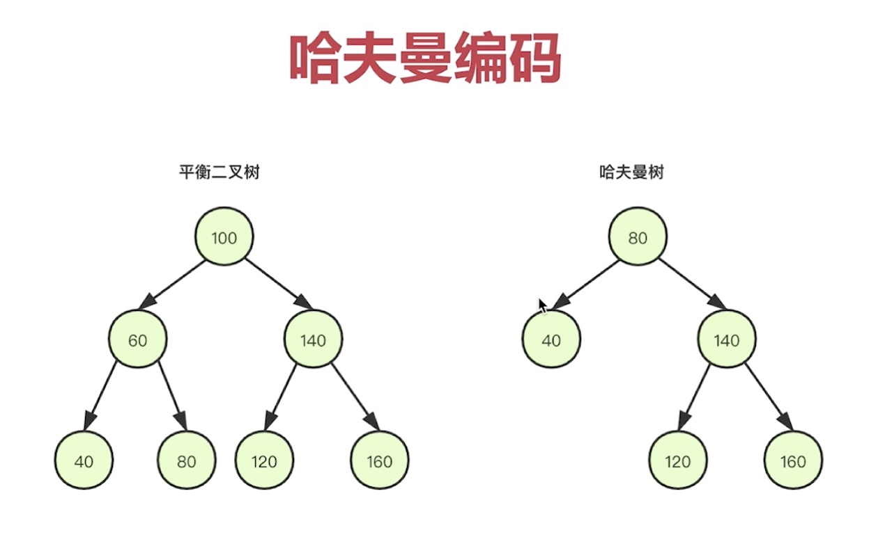
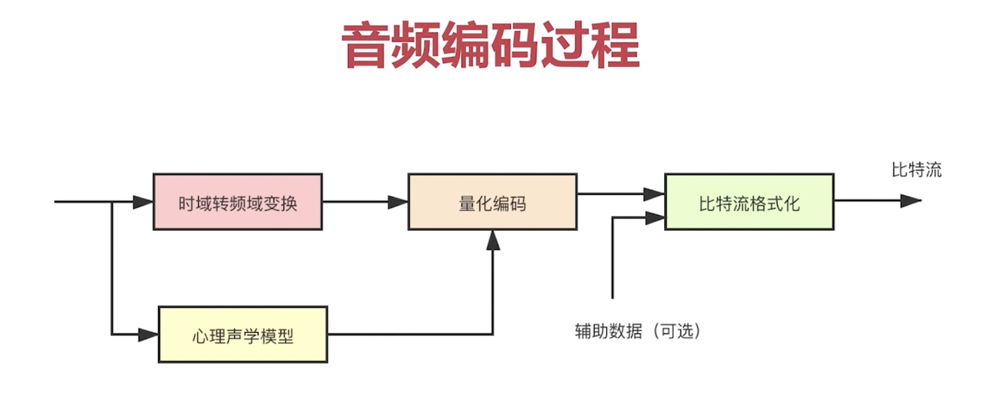
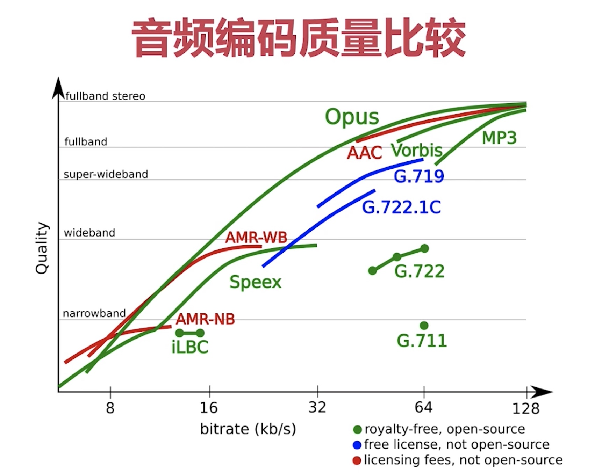
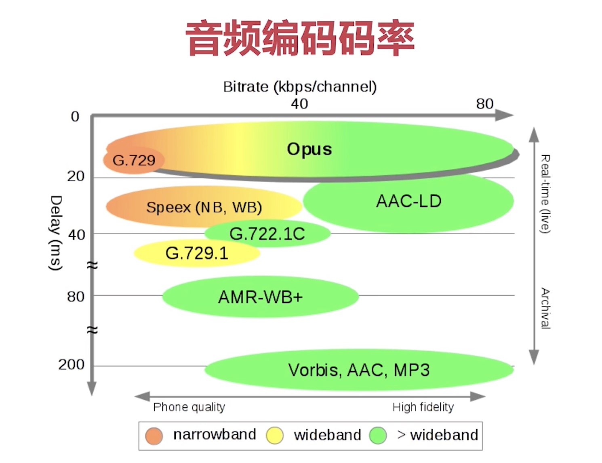
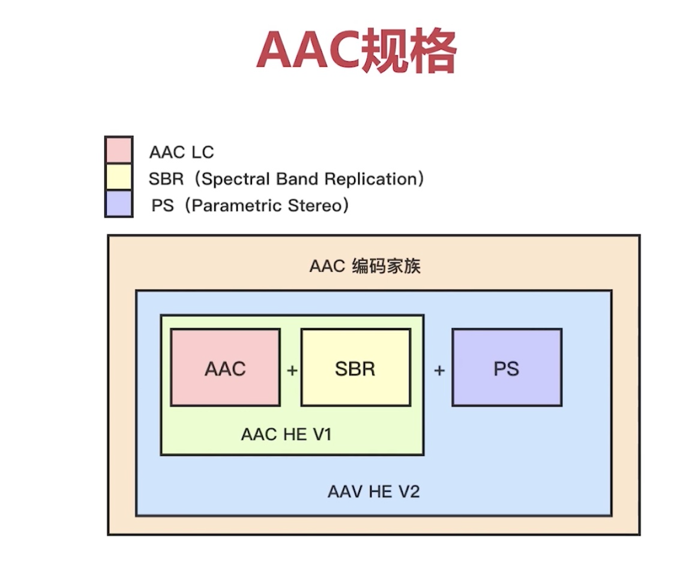
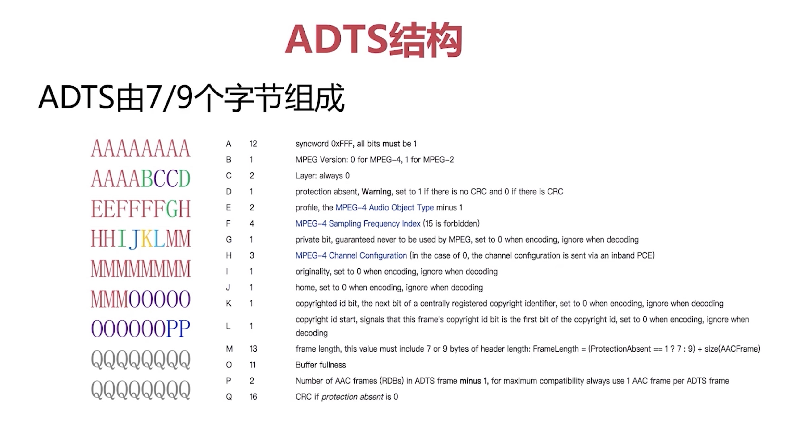
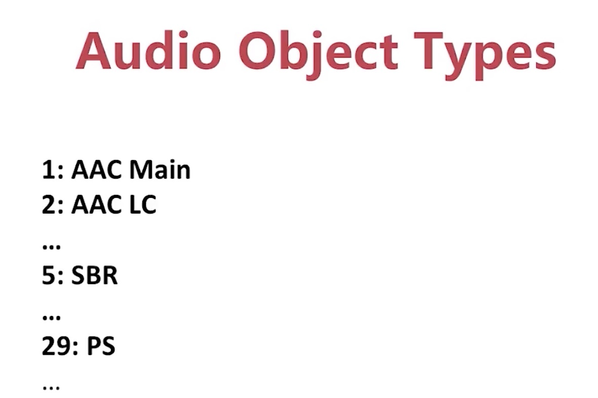
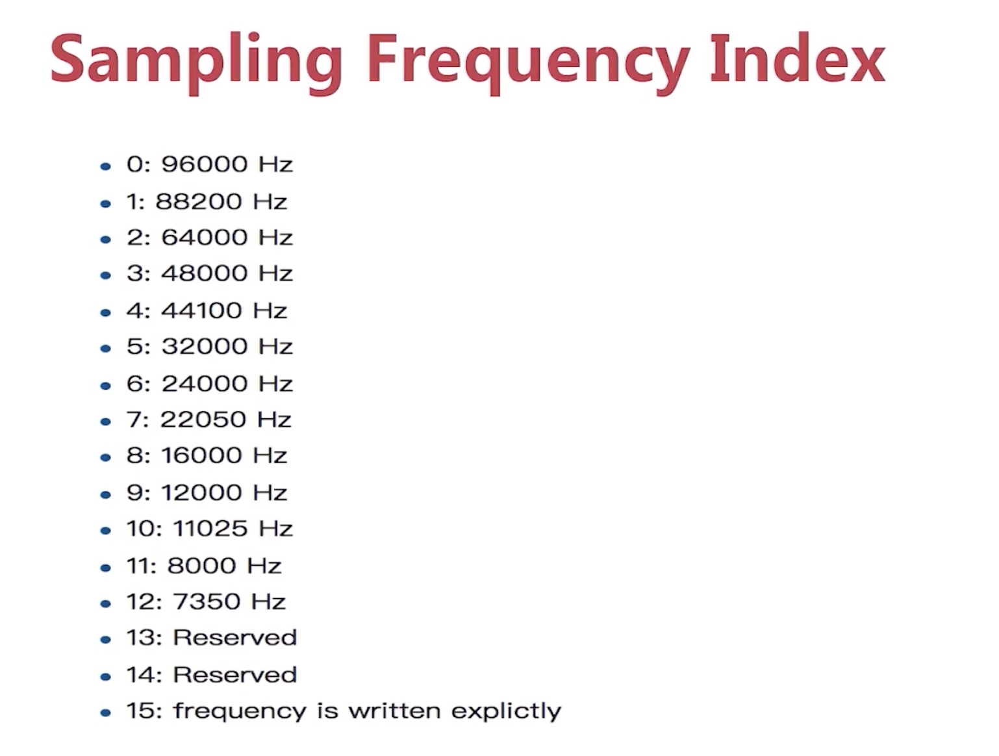

## 音频编码原理

- 有损压缩
- 无损压缩
- 几种常见的编解码器的比较
- AAC 编码器的介绍
- ADTS 格式
- 通过 FFmpeg 生成 AAC 数据

### 有损压缩

音频压缩有两个极端方向：压缩的量大、压缩的速度快。    

方法：消除冗余信息（人类听觉范围之外的声音，遮蔽掉的声音）

#### 信号的遮蔽

- 频域遮蔽
- 时域遮蔽



注：现实生活中例子，两个女声人吵架，声音高的人会覆盖掉声音低的人的声音。因为她们的频率很接近。   
女声和男生吵架，声音高的就不会覆盖声音低的人的声音。



### 无损压缩

#### 熵编码

- 哈夫曼编码
- 算术编码
- 香农编码

**哈夫曼编码：**
出现频率高的用短字节，出现频率低的用长字节。



---



### 几种常见的编解码器的比较

- Opus: 较新的编码器，WebRTC默认使用这个
- AAC:  在直播系统中，广泛使用
- Ogg:  收费
- Speex:支持回音消除
- iLBC:
- AMR
- G.711:窄带、失真、固话用

趋势：Opus 逐渐取代 AAC   
网上评测结果：Opus > AAC > Ogg > 其他






### AAC 编码器的介绍

AAC(Advanced Audio Coding),由多个公司（杜比实验室、AT&T、Sony）共同开发，目的是取代 MP3 格式。

- 压缩率高
- 保真性好

#### 常用规格

- AAC LC: 
- AAC HE V1
- AAC HE V2

##### AAC LC
Low Complexity,低复杂度规格，码流是 128k，音质好

##### AAC HE V1
AAC + SBR，按照频谱分保存。低频编码保存主要成分，高频单独放大编码保存音质。码流：64k 左右

##### AAC HE V2
AAC + SBR + PS，双声道的声音存在某种相似性，只需存储一个声道全部信息，然后用很少的字节用参数描述另外一个声道和它不同的地方。



#### ADIF
Audio Data Interchange Format, 这种格式可以确定地找到音频的开始，只能从头开始解码，不能在音频数据流中间开始

#### ADTS
Audio Data Transport Stream, 每一帧都有一个同步字，可以从音频流任意位置开始解码.

- 由 7 个或者 9 个字节表示。
- Audio Object Types: 下面的示意图编号要减去一
- Sampling Frequency Index
- [标准网站](http://www.p23.nl/projects/aac-header/)





### 通过 FFmpeg 生成 AAC 数据

```shell
# 换行前加上 反斜杠
 ffmpeg -i input.mp4 
 -vn 
 -c:a libfdk_aac 
 -ar 44100 
 -channels 2 
 -profile:a aac_he_v2 
 output.aac
```

#### 参数说明

- vn: Video Not ,没有视频,过滤掉视频
- c:a libfdk_aac: Codec:audio, 编码器是音频编码器（libfdk_aac）
- ar: 音频采样率
- channels: 音频声道数
- profile:a aac_he_v2: 音频的参数设置，格式设置为 aac_he_v2
