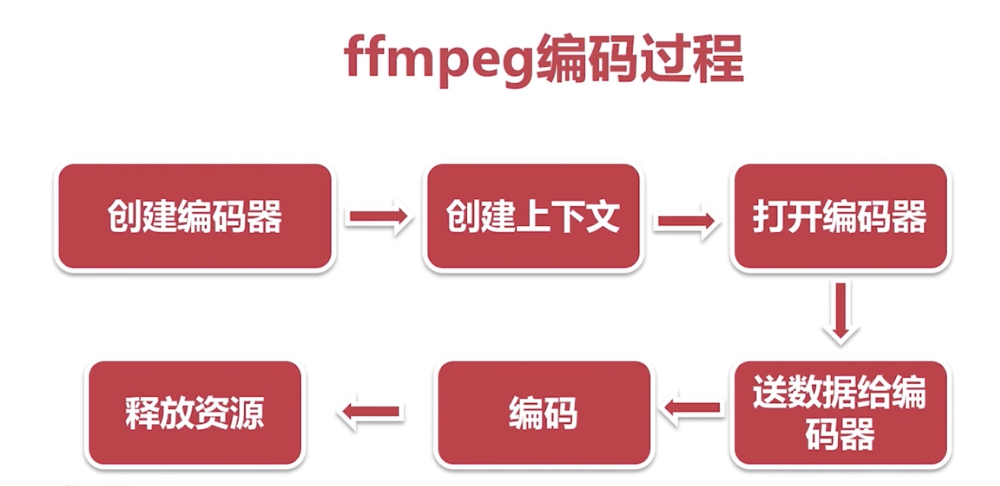

## 音频编码实战

在[音频采集实战](./audio_collection.md)的代码基础上进行。

- 音频重采样
- 创建 AAC 编码器

### 音频重采样
将音频三元组（采样率、采样大小、声道数）的值转成量外一组值。

- 采样大小也叫：位深；
- 任何一个数据改变都叫重采样；

#### 为什么要重采样

- 从设备采集的音频数据与编码器的要求数据不一致
- 扬声器要求的音频数据与想要播放的音频数据不一致
- 更方便运算：如处理回音消除，就要把多声道改为单声道。

#### 如何知道是否要进行重采样？

- 需要了解音频设备的参数
- 查看 FFmpeg 源码： 跨平台的，所以实现了各个平台；囊括了所有的编解码器实现

#### 重采样步骤（FFmpeg）

1. 创建重采样上下文
2. 设置参数
3. 初始化重采样
4. 重采样

**相关 API**

- swr_alloc_set_opts
- swr_init
- swr_convert
- swr_free

输出重采样的格式为：AV_SAMPLE_FMT_S16   
播放命令：
`ffplay -ar 44100 -ac 1 -f s16le audio.pcm`

### 创建 AAC 编码器

#### 创建并打开编码器

- 创建编码器 `avcodec_find_encoder`
- 创建上下文 `avcodec_alloc_context3`
- 打开编码器 `avcodec_open2`

