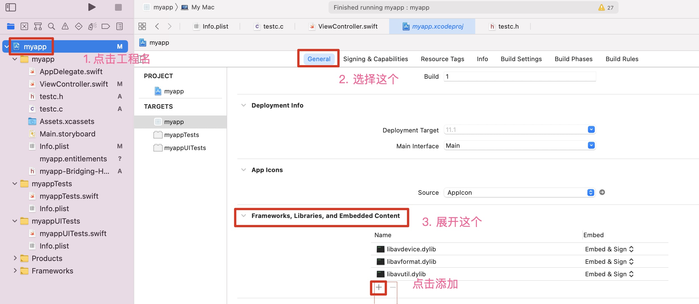

## 音频采集（实战,用 XCode）

- 采集方式
- FFmpeg 采集音频方式
- SWIFT 实战
- Mac App 引入 FFmpeg 库
- 打开音频设备
- 从音频设备中读取音频数据
- 代码优化
- 录制音频数据
- 通过界面来控制开启、关闭录制

### 采集方式

- Android 端采集：audio_recorder、media_recorder
- IOS 端采集：audio_unit
- Windows 端采集：directs、open**
- <font color="orange">FFmpeg 采集</font>

### FFmpeg 采集音频方式

- 通过命令
- 通过 API 方式


#### 通过命令

```
//avfoundation Mac 系统上
ffmpeg -f avfoundation -i :0 out.wav
```

### SWIFT 实战
用 XCode 
#### 语法

- var: 变量
- let: 常量
- if else
- switch case
- for
- while
- func

#### Swift 调用 C 语言

1. 编写 C语言
2. 在桥接头文件中引入 C的头文件
3. Swift 直接调用 C函数

### Mac 上采集音频

#### 1- Mac App 引入 FFmpeg 库

1. 将 FFmpeg 库文件和头文件拷贝到项目目录中
2. 引入库文件和头文件
3. 关闭沙箱

##### <font color="blue">引入库文件:</font>


##### <font color="blue">引入头文件:</font>


##### <font color="blue">关闭沙箱:</font>


**FFmpeg 采集音频流程**

打开音频设备 ---> 数据包 ---> 输出文件

##### 2- 打开音频设备

注册设备 ---> 设置采集方式 ---> 打开音频设备

###### 设置采集方式
不同平台不同。

- Mac OS:   avfoundation
- Windows:  dshow
- Linux:    alsa

#### 3- 从音频设备中读取数据

av_read_frame() 参数：

- AVFormatContext
- AVPacket
- 返回值 0 表示成功

AVPacket:

- data
- size

与 AVPacket 相关的 API：

- av_init_packet
- av_packet_unref: 释放 AVPacket 资源
- av_packet_alloc: 分配堆空间，生成 AVPacket
- av_packet_free:

#### 4- 录制音频数据

- 创建文件
- 写数据到文件
- 关闭文件

播放生成到音频文件：
```c
ffplay -ar 44100 -ac 2 -f f32le audio.pcm
```

#### 5- 用按钮来控制开始和关闭录制

<font color="red">问题，录下的声音，变声、快放</font>


