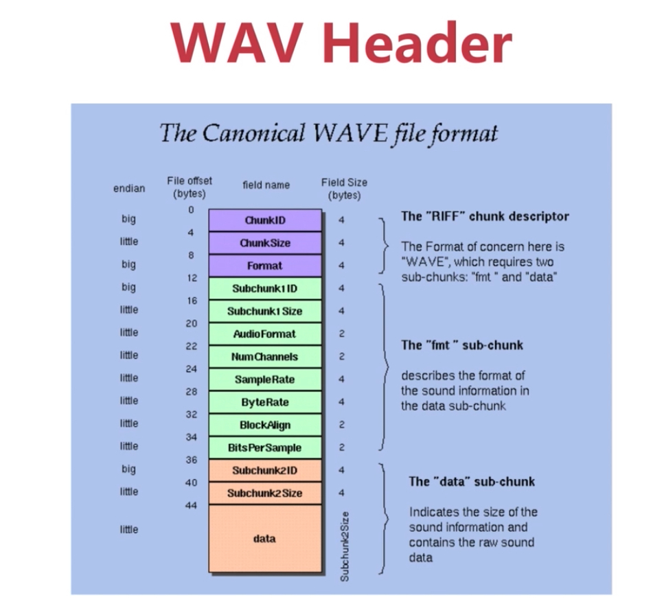
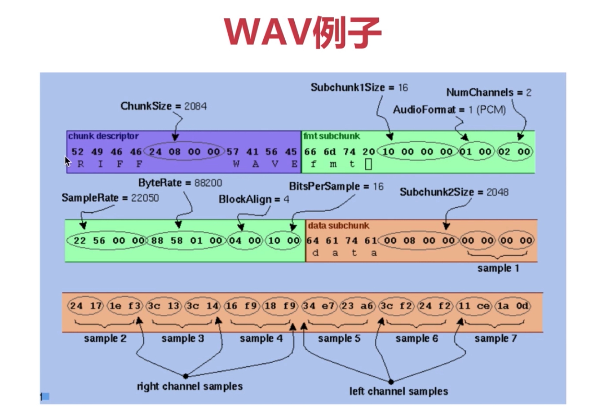

## 音频原始数据

PCM / WAV

### 量化基本概念

- 采样大小： 一个采样用多少 bit 存放。常用的是 16bit
- 采样率：采样频率（8k、16k、32k、44.1k、48k）
- 声道数：单声道、双声道、多声道

### PCM

PCM 码率 = 采样大小 * 采样率 * 声道数

### WAV
既可以存原始数据，也可以存压缩数据。PCM + 头。头含有了一些基本信息。

- 第一行紫色部分，WAVE 是一种协议。
- 第一行 fmt 后面是重要的参数