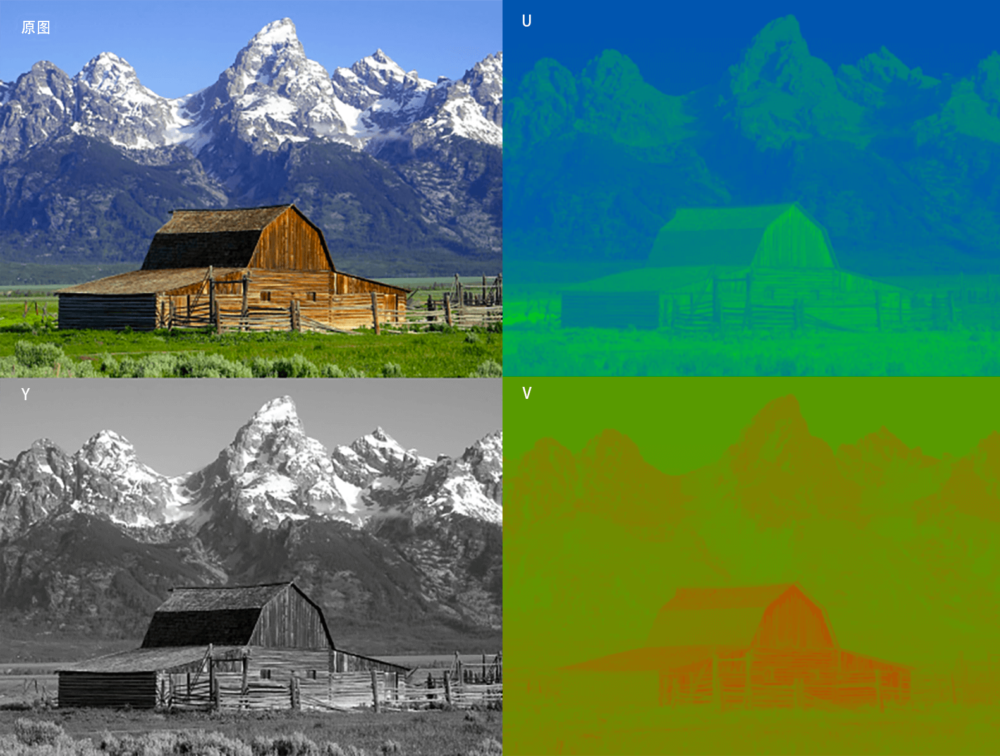

## 如何从色彩格式、帧率等参数角度看视频图像？

[原文](https://time.geekbang.org/column/article/541546)

### 视频、图像像素点数据格式

常见的色彩格式:

- GRAY 色彩空间
- YUV 色彩空间
- RGB 色彩空间
- HSL 和 HSV 色彩空间

#### GRAY 色彩空间

在 20 世纪 80、90 年代，国内大多数家庭看的还是黑白电视。那个黑白电视的图像就是以 GRAY 的方式展现的图像，也就是 Gray 灰度模式。这一模式为 8 位展示的灰度，取值 0 至 255，表示明暗程度，0 为最黑暗的模式，255 为最亮的模式，色彩表示范围如图所示：

由于每个像素点是用 8 位深展示的，所以一个像素点等于占用一个字节，一张图像占用的存储空间大小计算方式也比较简单：举个例子，如果图像为 352x288 的分辨率，那么一张图像占用的存储空间应该是 352x288，也就是 101376 个字节大小。

#### YUV 色彩空间
亮度和色度两部分组成；
在视频领域，通常以 YUV 的格式来存储和显示图像。其中 Y 表示视频的灰阶值，也可以理解为亮度值(Luminance)，而 UV 表示色彩度，如果忽略 UV 值的话，我们看到的图像与前面提到的 GRAY 相同，为黑白灰阶形式的图像。YUV 最大的优点在于每个像素点的色彩表示值占用的带宽或者存储空间非常少。你可以看一下这张图片，是原图与 YUV 的 Y 通道、U 通道和 V 通道的图像示例：

- Luminance(亮度)
- Chrominance(色度): 任意一种颜色与亮相同一个指考色之间差异,如彩色电视采用白色为考色

为节省带宽起见，大多数 YUV 格式平均使用的每像素位数都少于 24 位。主要的色彩采样格式有 YCbCr 4：2：0、YCbCr 4：2：2、YCbCr 4：1：1 和 YCbCr 4：4：4。YUV 的表示法也称为 A：B：C 表示法。

##### 说明: 

- Cb: Chrominance blue
- Cr: Chrominance red

#### RGB 色彩空间

#### HSL 和 HSV 色彩空间