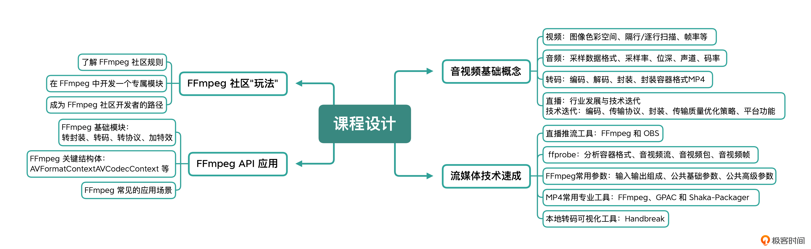

## 快速入门音视频技术

来自极客时间

### 快速进入音视频领域

- 基础概念与知识
- 突破口
- 知识迁移，做到举一反三

### 基础概念与知识

- 什么是 PCM？
- 怎么计算音频的码率？
- 帧率是什么？
- 都有哪些种类？
- 为什么会出现视频播放不了的情况？
- FFmpeg 有哪些功能？具体应该怎么使用

### 突破口

FFmpeg 是音视频平台及音视频系统开发工作中必不可少的一个组件库，也是我们掌握音视频编解码基础知识与流程的重要抓手。如果能够掌握 FFmpeg 的用法，那音视频方面的一些基本操作都难不住你。

---

### 课程大纲

