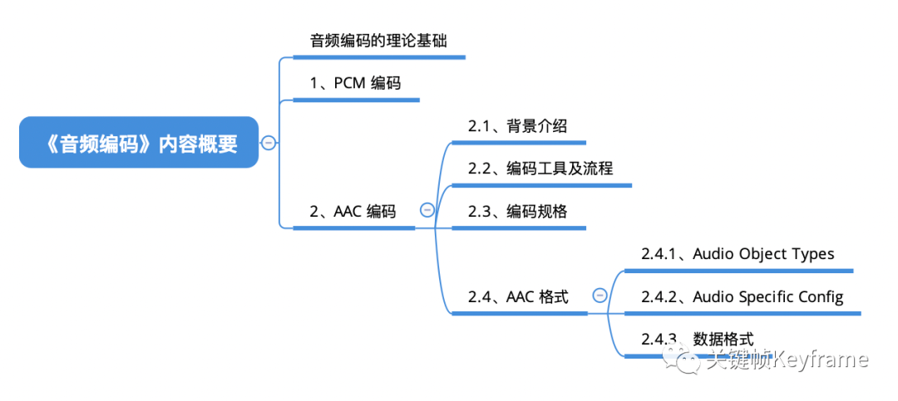
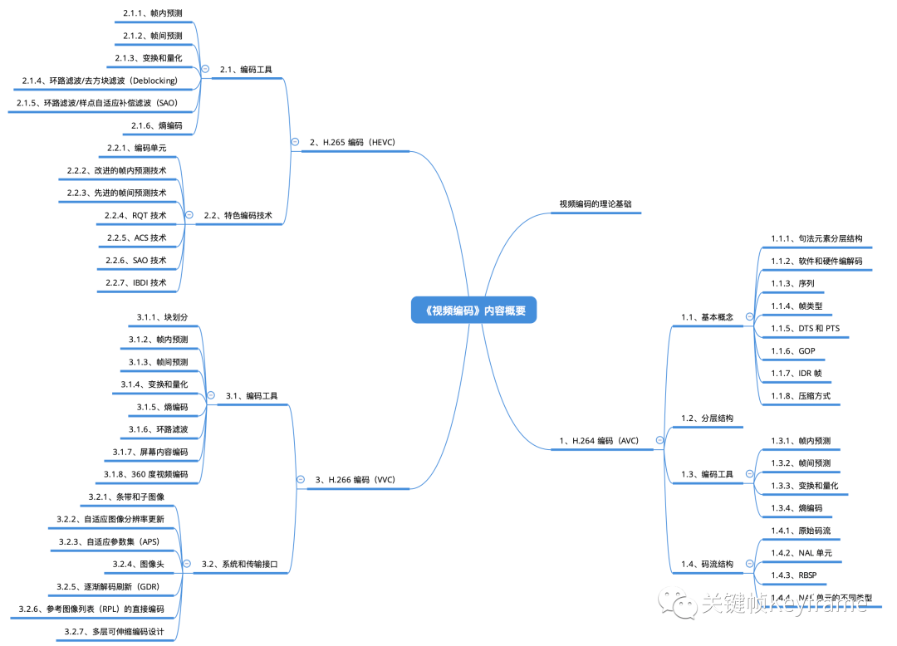

## 音视频编码

这个章节的几篇文章主要介绍了音频和视频主流的编码格式，比如音频的 PCM、AAC，视频的 H.264、H.265、H.266。我们介绍了这些编码格式的原理、规范和技术优化，帮助大家更深入的理解音视频编码。

### 音频编码

- [音频编码：PCM 和 AAC](./section_1.md)

### 视频编码

- [视频编码1：H.264(AVC)](./section_2.md)
- [视频编码2：H.265(HEVC)](./section_3.md)
- [视频编码3：H.266(VVC)](./section_4.md)