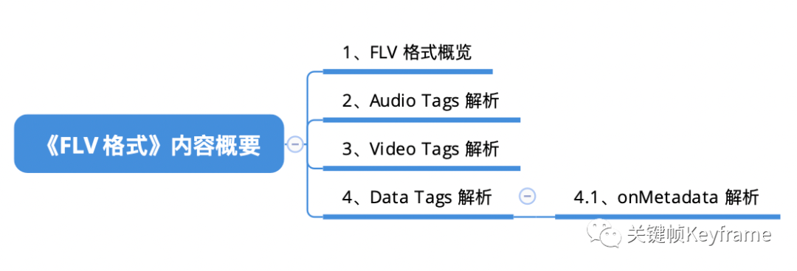

## FLV 格式：直播常用格式

本文介绍了 FLV 流媒体格式，FLV 是一种结构相对简单的格式。在直播领域，由于 RTMP 推流、HTTP-FLV 播放的整套方案低延时的特性，以及服务端普遍提供 HTTP Web 服务，能更广泛的兼容 HTTP-FLV，使得 FLV 仍然是大多数直播产品的首选流媒体格式。

[原文](https://mp.weixin.qq.com/s?__biz=MjM5MTkxOTQyMQ==&mid=2257484681&idx=1&sn=f78420b6b5ceb7339d79b871b4c8f9cf&scene=21#wechat_redirect)