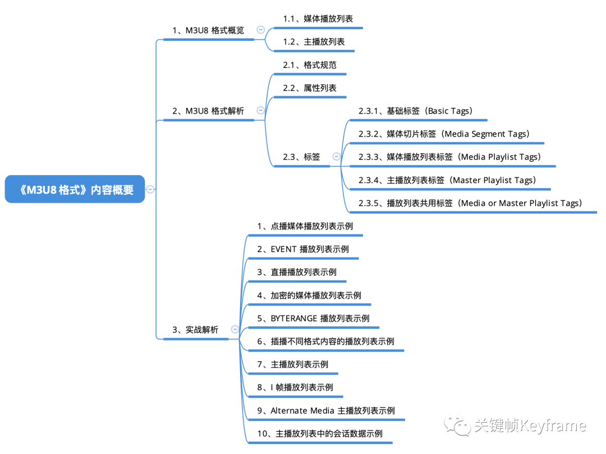

## M3U8 格式：直播回放常用格式

本文介绍了 M3U8 媒体格式，M3U8 是苹果公司推出的 HLS(HTTP Live Streaming) 协议的基础。在实际应用场景中，由于 HLS/M3U8/TS 这套方案在控制直播延时上不太理想，所以一般实时直播场景不会选择使用 M3U8 媒体格式。但是，对于直播回放这种场景，由于使用 M3U8/TS 这套方案能够在直播过程中就持续生成和存储切片，所以直播回放基本上都会选择 M3U8 媒体格式。

[原文](https://mp.weixin.qq.com/s?__biz=MjM5MTkxOTQyMQ==&mid=2257484691&idx=1&sn=732130c93ad65f48058f6c7f678731f6&scene=21#wechat_redirect)