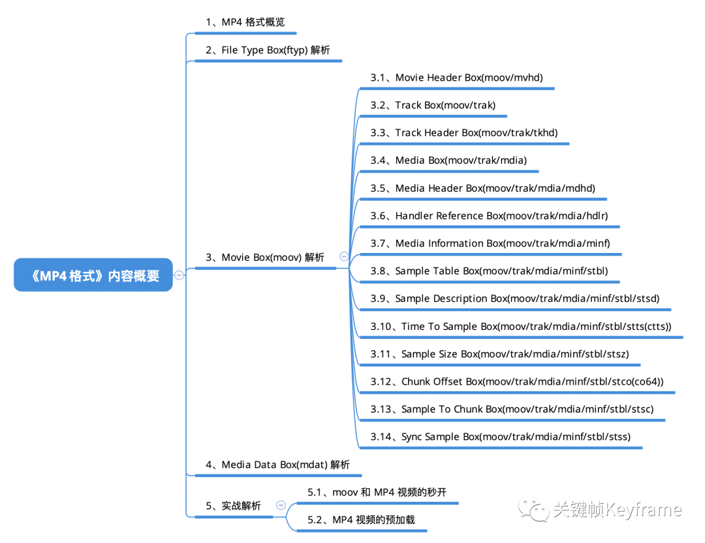

## MP4 格式：短视频常用格式

本文介绍了当下互联网短视频最常使用的封装格式 MP4 的基础格式。MP4 格式是以 Box 的形式进行组织，本文着重介绍了 File Type Box(ftyp)、Media Data Box(mdat)，以及最重要的 Movie Box(moov) 及其重要子 Box，并给出案例分析了 Box 的结构对优化视频播放体验的作用。

[原文](https://mp.weixin.qq.com/s?__biz=MjM5MTkxOTQyMQ==&mid=2257484677&idx=1&sn=a868911489519592930e18a60966d6a1&scene=21#wechat_redirect)