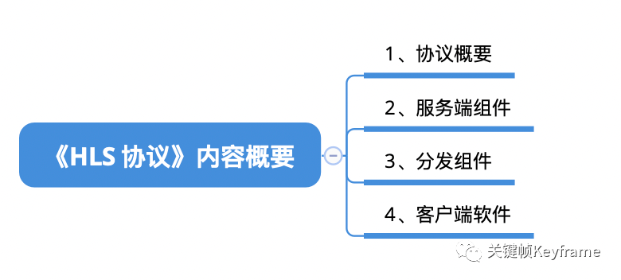

## HLS协议：直播回放常用协议

HLS 作为苹果公司提出的协议，在 iOS 客户端上得到了很好的支持，比如 AVPlayer 和 Safari 都支持对 HLS 流媒体的播放；再加上 M3U8/TS 封装格式可以在直播中持续处理和存储流媒体数据，所以直播回放通常都会选择 HLS 协议来实现。HLS 协议的实现是和 M3U8 文件的定义密切相关的，这部分的知识在《M3U8 格式》中已经做了详细介绍。本文则简单介绍一下 HLS 协议的整体框架。

- [原文](https://mp.weixin.qq.com/s?__biz=MjM5MTkxOTQyMQ==&mid=2257484829&idx=1&sn=07896e5c1f7cb5451462dfce0b6e6e54&scene=21#wechat_redirect)