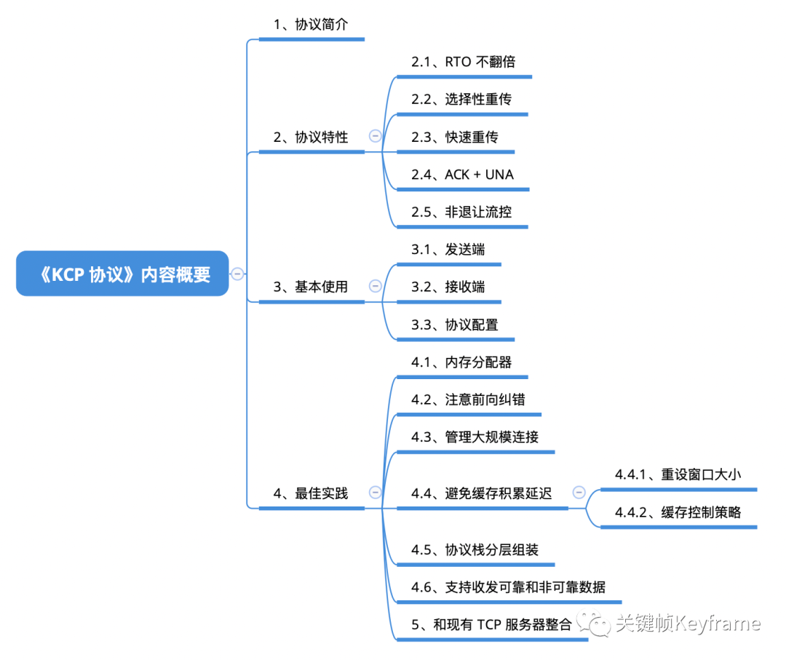

## KCP协议：自研常用参考协议

KCP 是一个开源的快速可靠协议，能以比 TCP 浪费 10%-20% 带宽的代价，换取平均延迟降低 30%-40%，最大延迟降低 3 倍的传输速度。本文介绍了 KCP 协议的特性、基本使用方式及最佳使用实践。

- [原文](https://mp.weixin.qq.com/s?__biz=MjM5MTkxOTQyMQ==&mid=2257484828&idx=1&sn=384ce6a7128ac3ce3f2cec5416d61ce0&scene=21#wechat_redirect)