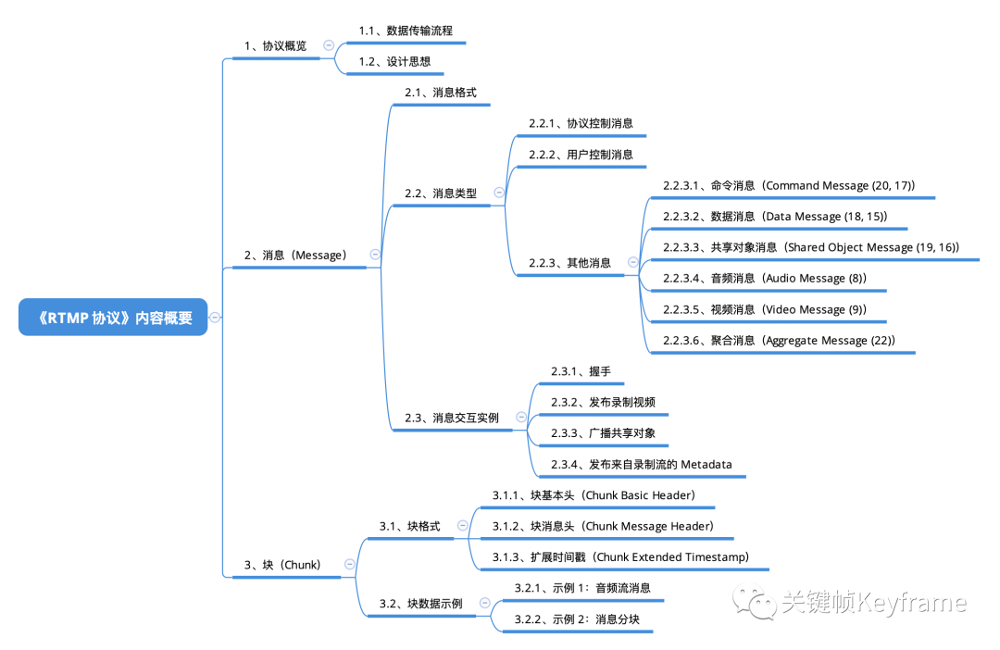

## RTMP协议：直播推流常用协议

由于协议设计对低延时、音视频同步等能力的良好支持，RTMP 是实时直播场景，尤其是在推流上行链路中，最常用的传输协议之一。本文主要介绍了 RTMP 协议的数据传输流程和协议设计思想，并详细介绍了消息和块的具体细节规范。

- [原文](https://mp.weixin.qq.com/s?__biz=MjM5MTkxOTQyMQ==&mid=2257484827&idx=1&sn=249da45e5c2c6bff776fe0fdcff42548&scene=21#wechat_redirect)