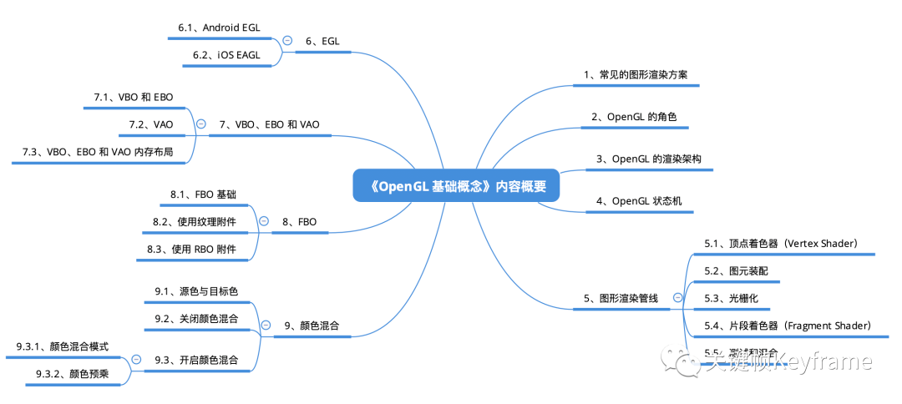

## 渲染

这个章节的几篇文章主要介绍了 OpenGL 的一些基础概念，对这些基础概念的正确理解将为后续更深入的学习 OpenGL 做好铺垫。

- [OpenGL 基础概念1: 渲染架构、状态机、渲染管线](./section_1.md)
- [OpenGL 基础概念2: EGL](./section_2.md)
- [OpenGL 基础概念3: VBO、EBO、VAO](./section_3.md)
- [OpenGL 基础概念4: FBO](./section_4.md)
- [OpenGL 基础概念5: 颜色混合](./section_5.md)