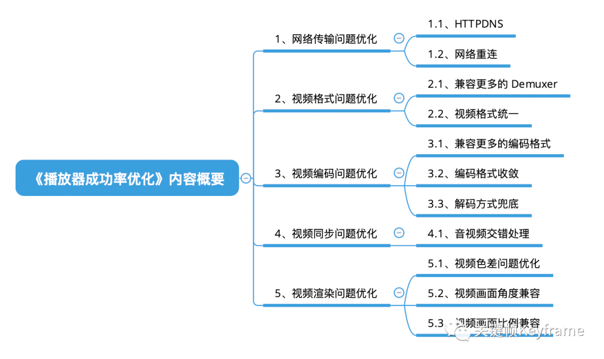

## 音视频消费

这个章节的几篇文章主要介绍了音视频消费端播放器的关键指标定义及优化思路。

- [音视频消费关键指标：播放器成功率优化](./section_1.md)
- [音视频消费关键指标：播放器秒开优化](./section_2.md)
- [音视频消费关键指标：播放器卡顿优化](./section_3.md)
- [音视频消费关键指标：直播延时优化](./section_4.md)
- 

