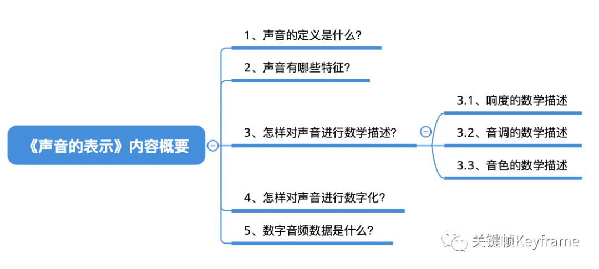

## 声音和图像基础

这个章节的几篇文章从将我们耳朵听见的声音、眼睛看见的画面，数字化为我们用手机、电脑所处理的音频数据和图像数据，其中经历了什么？这个问题出发，分别探讨了声音和图像相关的基础原理知识。这其中包含了如何对司空见惯的声音和图像进行物理定义、特征探索、规律发现、数学描述，并用信息处理手段对它们进行数字化的过程。这些知识可能在音视频开发中并不会经常用到，但是对于我们更深入的理解音视频是有很大帮助的。

### 声音

- [声音的表示1：声音的定义和特征](./section_1.md)
- [声音的表示2：声音的数学描述](./section_2.md)
- [声音的表示3：声音的数字化](./section_3.md)

### 图像

- [图像的表示1：图像的定义和成像原理](./section_4.md)
- [图像的表示2：图像的数学描述](./section_5.md)
- [图像的表示3：图像的数字化](./section_6.md)