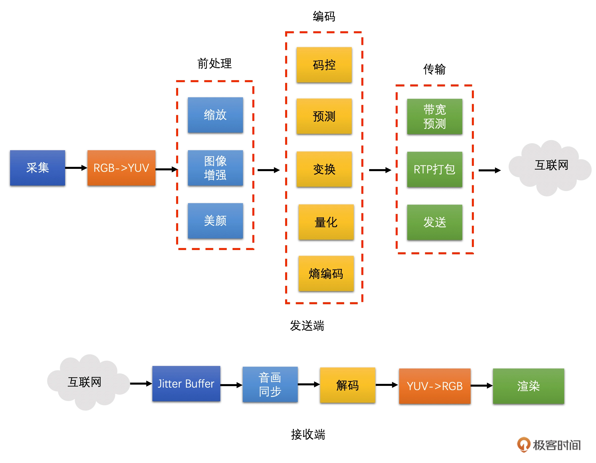

## 为什么说视频开发是程序员的一片蓝海？

- 现在就是视频技术最好的时代
    - 一方面，如你所见，当下即是刚需，视频技术的应用已经成为互联网平台的标配；
    - 另一方面，未来即是星辰大海，随着 AI、元宇宙等技术的发展，视频技术还有无限的想象空间。
    
- 学习门槛
    - 抖音和快手的短视频需要应用图像处理和视频编码技术，如何在保持高画质的情况下，尽量减少视频文件的大小，是很难也很重要的；
    - 连麦直播则需要懂 RTC 和直播技术，如何能够保证在各种网络状况下实现超低延时、降低卡顿率是一个非常难的问题；
    - 视频会议则需要你十分熟悉 RTC 和转码合流服务等技术，几十上百人的大型视频会议，如何保证流畅度、卡顿率、画质等指标也是十分具有挑战性的。
    - DCT 变换公式
  
- 视频技术难上手的另一个重要原因就是它涉及的技术太多了
    - 视频前处理，就涉及到很多信号处理和 AI 技术；
    - 视频的编码算法，则会涉及到信息论和数学；
    - 视频的传输就更多了，包含了各种网络协议和拥塞控制算法。
    - 目前市面上系统讲解视频的书籍和课程也是比较少的
  
- 知识图谱
  

  
---

### 课程设计

- 图像基础和前处理
- 视频编码
- 视频传输和网络对抗
- 视频封装和播放

#### 图像基础和前处理

从视频和图像的基本概念讲起，陆续延伸到视频的颜色空间，尤其是 YUV 颜色空间，这是视频技术中非常重要的基础知识，   
同时也是很多视频工程师的学习难点。之后会讨论工程上常用的图像缩放算法及其原理。打好基础，后面事半功倍。

#### 视频编码

主要讲解在视频技术中占据重要地位的视频编码技术，重点学习编码算法的底层原理和具体算法的实现，让我们在使用编解码器的同时，   
也能更深一层，洞察其工作原理。另外，H264 码流是视频开发中必学的，所以我也会在这里和你讨论它的结构以及相关工程问题。深入原理，才能快速实践。

#### 视频传输和网络对抗

以实践为主，讲解具体的视频传输和弱网对抗技术，主要包括如何打包视频、预测网络带宽，以及如何在有限的带宽情况下控制好编码器的码率和发送包的速度。   
之后，我会手把手带你解决两个代表性的视频 Bug“花屏和卡顿”，并介绍一下视频会议中的常用技术 SVC。

#### 视频封装和播放

介绍常用的视频封装技术，并解决视频工程难题：音视频同步。

