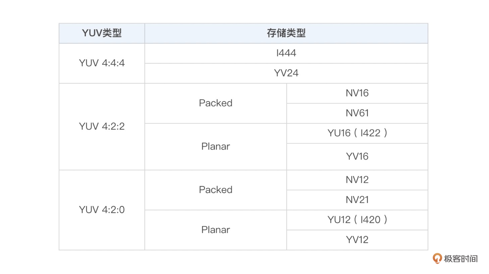

## YUV & RGB：原来图像是这么丰富多彩的

- 图像的颜色空间

### 图像的颜色空间

不同应用领域就建立了多种不同的颜色空间，主要包括 RGB 、YUV、CMYK 、 HSI 等（后面两种和这门课程没有关系，因此这里我们不再介绍）。

- RGB
- YUV

#### RGB

图像的每一个像素都有 R、G、B 三个值。RGB 是我们平常遇到最多的一种图像颜色空间，比如摄像头采集的原始图像就是 RGB 图像，且显示器显示的图像也是 RGB 图像。

#### YUV

YUV 最早主要是用于电视系统与模拟视频领域。现在视频领域基本都是使用 YUV 颜色空间。  

- YUV 图像将亮度信息 Y 与色彩信息 U、V 分离开来。Y 表示亮度，是图像的总体轮廓，称之为 Y 分量。U、V 表示色度，主要描绘图像的色彩等信息，分别称为 U 分量和 V 分量。
- 分类：YUV 4:4:4、YUV 4:2:2、YUV 4:2:0
    - YUV 4:4:4：每一个 Y 就对应一个 U 和一个 V => 每一个 Y 对应一组 UV。
    - YUV 4:2:2：每两个 Y 共用一个 U、一个 V => 每两个 Y 共用一组 UV。
    - YUV 4:2:0：每四个 Y 共用一个 U、V => 每四个 Y 共用一组 UV。
  
##### YUV 存储方式

- Planar
- Packed

###### Planar

先连续存储所有像素点的 Y，然后接着存储所有像素点的 U，之后再存储所有像素点的 V，也可以是先连续存储所有像素点的 Y，然后接着存储所有像素点的 V，之后再存储所有像素点的 U。

###### Packed

先存储完所有像素的 Y，然后 U、V 连续的交错存储。

**YUV类型及对应的存储类型**: 

### RGB 和 YUV 之间的转换

- Color Range: 分为 **Full Range** 和 **Limited Range**
- 转换标准：BT709 和 BT601

#### 注意事项

在处理 YUV 图像的存储和读取的时候，也是有 Stride 这个概念的。事实上，YUV 出问题的情况更多。
