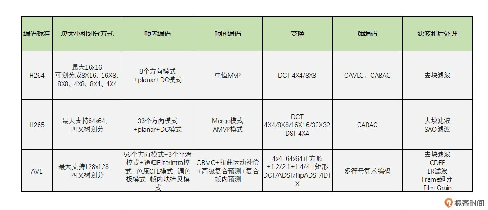
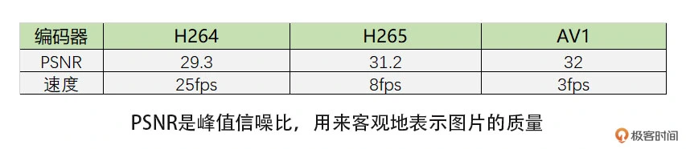

### 编码原理：视频究竟是怎么编码压缩的？

- RGB 转 YUV
- 宏块
- 数据冗余
- 举例（YUV）
- 总结
- 编码器的对比及选择
- 小结

#### RGB 转 YUV

视频编码是对一帧帧图像来进行的。一般我们所熟知的彩色图像的格式是 RGB 的，即用红绿蓝三个分量的组合来表示所有颜色。   
但是，RGB 三个颜色是有相关性的，为了去掉这个相关性，减少需要编码的信息量，我们通常会把 RGB 转换成 YUV，也就是 1 个亮度分量和 2 个色度分量。

#### 宏块

对于每一帧图像，又是划分成一个个块来进行编码的，这一个个块在 H264 中叫做宏块，而在 VP9、AV1 中称之为超级块，其实概念是一样的。

**宏块大小**：一般是 16x16、64x64、128x128

#### 数据冗余

图像一般都是有数据冗余的，主要包括以下 4 种：

- 空间冗余：比如说将一帧图像划分成一个个 16x16 的块之后，相邻的块很多时候都有比较明显的相似性，这种就叫空间冗余。
- 时间冗余：一个帧率为 25fps 的视频中前后两帧图像相差只有 40ms，两张图像的变化是比较小的，相似性很高，这种叫做时间冗余。
- 视觉冗余：我们的眼睛是有视觉灵敏度这个东西的。人的眼睛对于图像中高频信息的敏感度是小于低频信息的。有的时候去除图像中的一些高频信息，人眼看起来跟不去除高频信息差别不大，这种叫做视觉冗余。
- 信息熵冗余：我们一般会使用 Zip 等压缩工具去压缩文件，将文件大小减小，这个对于图像来说也是可以做的，这种冗余叫做信息熵冗余。

视频编码就是通过减少上述 4 种冗余来达到压缩视频的目的。

#### 举例（YUV）

- 首先第一步，我们通过减少图像块的空间冗余和时间冗余来接近这个目标。刚才我们也说到，图像内部相邻宏块之间有很多相似性，   
并且两张图像之间也有很多相似性。因此，根据图像的这个特点，我们可以在编码的时候进行帧内预测和帧间预测。
- DCT 变换和量化（我们的目标不只是将像素值变小，而是希望能出现连续的 0 像素，那怎么办呢？）

#### 总结

先通过帧内预测或者帧间预测去除空间冗余和时间冗余，从而得到一个像素值相比编码块小很多的残差块。    
之后我们再通过 DCT 变换将低频和高频信息分离开来得到变换块，然后再对变换块的系数做量化。由于高频系数通常比较小，   
很容易量化为 0，同时人眼对高频信息不太敏感，这样我们就得到了一串含有很多个 0，大多数情况下是一串含有连续 0 的“像素串”，   
并且人的观感还不会太明显。这样，最后熵编码就能把图像压缩成比较小的数据，以此达到视频压缩的目的。这就是**视频编码的原理**。

#### 编码器的对比及选择

##### 常见的编码标准

- H264
- H265
- VP8
- VP9
- AV1

###### 特点

- 目前 H264 和 VP8 是最常用的编码标准，且两者的标准非常相似。
- H265 和 VP9 分别是H264 和 VP8的下一代编码标准，这两个标准也非常相似。
- AV1 是 VP9 的下一代编码标准
- H264 和 H265 是需要专利费的
  - 由于 H265 需要付高额的版权费，以谷歌为首的互联网和芯片巨头公司组织了 AOM 联盟，开发了新一代压缩编码算法 AV1，并宣布完全免费，以此来对抗高额专利费的 H265。
- VP8 和 VP9 是完全免费的
- 目前普通产品还是使用 H264 最多，而 H265 因为专利费使用得比较少。
- VP8 是 WebRTC 默认的编码标准，且 WebRTC 使用 VP8 最多。
- WebRTC 也支持 VP9 和 AV1。

###### 几种编码器对比

###### 编码器选择

如果是在性能比较差的机器上编码，最好使用 H264 和 VP8 等速度快的编码器。如果是在比较新的机器上，可以考虑 H265 编码。   
中等机器如果支持 H265 硬编也是可以考虑的。但有一个问题就是 H265 需要考虑专利费的问题，同时浏览器原生不支持 H265 编码，   
所以有这方面需求的，最好不要使用 H265，可以考虑使用 VP9，甚至可以考虑 AV1。另外，由于 AV1 原生标准就支持屏幕编码的优化，   
所以屏幕编码场景下可以考虑使用 AV1 编码。

#### 小结

视频编码的必要性，以及视频编码的原理。视频编码主要分为熵编码、预测、DCT 变换和量化这几个步骤。
- 熵编码（以行程编码为例）：视频编码中真正实现“压缩”的步骤，主要去除信息熵冗余。在出现连续多个 0 像素的时候压缩率会更高。
- 帧内预测：为了提高熵编码的压缩率，先将当前编码块的相邻块像素经过帧内预测算法得到帧内预测块，再用当前编码块减去帧内预测块得到残差块，从而去掉空间冗余。
- 帧间预测：类似于帧内预测，在已经编码完成的帧中，先通过运动搜索得到帧间预测块，再与编码块相减得到残差块，从而去除时间冗余。
- DCT 变换和量化：将残差块变换到频域，分离高频和低频信息。由于高频信息数量多但大小相对较小，又人眼对高频信息相对不敏感，我们利用这个特点，使用 QStep 对 DCT 系数进行量化，将大部分高频信息量化为 0，达到去除视觉冗余的目的。
  
这里你需要注意的是，视频编码实际的步骤是预测、DCT 变换和量化，最后是熵编码。经过这几步操作之后，视频中的冗余信息大部分被去除，达到了编码压缩的效果。
