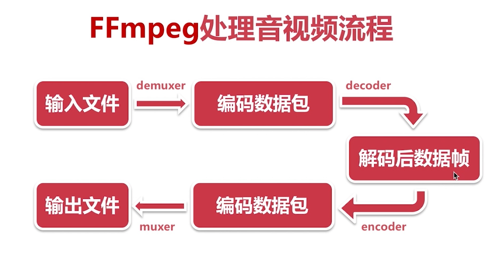
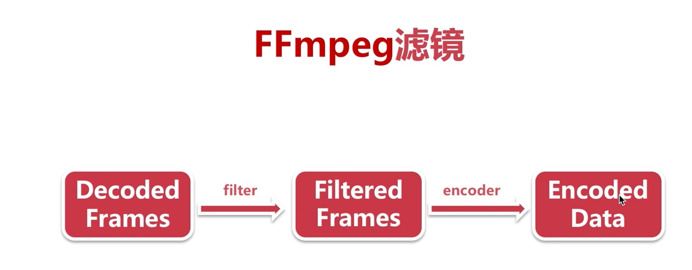

## FFmpeg 常用命令

### 简介

1. 不同音视频格式转换，如: mp4 -> flv
2. 音频和视频合并,
3. 录制
4. 裁剪
5. 分辨率转换



### 分类

- [基本信息查询命令](#基本信息查询命令)
- [录制命令](#录制命令)
- [分解与复用命令](#分解与复用命令)
- [处理原始数据命令](#处理原始数据命令)
- [裁剪与合并命令](#裁剪与合并命令)
- [图片与视频互转命令](#图片与视频互转命令)
- [直播相关命令](#直播相关命令)
- [滤镜命令](#滤镜命令)

---


### 基本信息查询命令

```shell
-version

# 显示可用的 demuxer
-demuxers

# 显示可用的 muxer
-muxers

# 显示可用的设备
-devices

# 显示所有编解码器
-codecs

# 显示可用的解码器
-decoders

# 显示可用的编码器
-encoders

# 显示比特流 filter
-bsfs

# 显示可用的格式
-formats

# 显示可用的协议
-protocols

# 显示可用的过滤器
-filters

# 显示可用的像素格式
-pix_fmts

# 显示可用的采样格式
-sample_fmts

# 显示channel名称
-layouts

# 显示识别的颜色名称
-colors

```

### 录制命令

- 录制视频
- 录制声音
- 同时录制视频和音频到一个文件: ``ffmpeg -f avfoundation -i "1:0" -r 30 output.mp4``

#### 录制视频

```shell
# mac 下
ffmpeg -f avfoundation -i 1 -r 30 out.yuv
```
- `-f` 指定用什么库采集数据
- `-i` 指定从哪里采集数据，后面的1是文件索引号
- `-r` 指定帧率

执行命令后，终端开始会输出:
```shell
ffmpeg -f avfoundation -i 1 -r 30 out.yuv
ffmpeg version N-95190-gf66458cfc7 Copyright (c) 2000-2019 the FFmpeg developers
  built with Apple clang version 12.0.0 (clang-1200.0.32.28)
  configuration:
  libavutil      56. 35.100 / 56. 35.100
  libavcodec     58. 59.101 / 58. 59.101
  libavformat    58. 33.100 / 58. 33.100
  libavdevice    58.  9.100 / 58.  9.100
  libavfilter     7. 61.100 /  7. 61.100
  libswscale      5.  6.100 /  5.  6.100
  libswresample   3.  6.100 /  3.  6.100
objc[57975]: class `NSKVONotifying_AVCaptureScreenInput' not linked into application
objc[57975]: class `NSKVONotifying_AVCaptureScreenInput' not linked into application
[AVFoundation indev @ 0x7fe103005080] Configuration of video device failed, falling back to default.
[avfoundation @ 0x7fe10380a000] Selected pixel format (yuv420p) is not supported by the input device.
[avfoundation @ 0x7fe10380a000] Supported pixel formats:
[avfoundation @ 0x7fe10380a000]   uyvy422
[avfoundation @ 0x7fe10380a000]   yuyv422
[avfoundation @ 0x7fe10380a000]   nv12
[avfoundation @ 0x7fe10380a000]   0rgb
[avfoundation @ 0x7fe10380a000]   bgr0
[avfoundation @ 0x7fe10380a000] Overriding selected pixel format to use uyvy422 instead.
[avfoundation @ 0x7fe10380a000] Stream #0: not enough frames to estimate rate; consider increasing probesize
Input #0, avfoundation, from '1':
  Duration: N/A, start: 833744.102167, bitrate: N/A
    Stream #0:0: Video: rawvideo (UYVY / 0x59565955), uyvy422, 2880x1800, 1000k tbr, 1000k tbn, 1000k tbc
Stream mapping:
  Stream #0:0 -> #0:0 (rawvideo (native) -> rawvideo (native))
Press [q] to stop, [?] for help
Output #0, rawvideo, to 'out.yuv':
```

上面有录制视频的分辨率: 2880x1800

```shell
# 播放录制的文件 out.yuv
ffplay -s 2880x1800 -pix_fmt uyvy422 out.yuv
```
注意：需要指定格式 uyvy422，因为 ffplay 播放默认格式为 yuv420p

##### 关于设备索引号
在 mac 中查看 avfoundation 库支持的设备

```shell
ffmpeg -f avfoundation -list_devices true -i ""
```

输出如下:
```shell
[AVFoundation indev @ 0x7f994ba041c0] AVFoundation video devices:
[AVFoundation indev @ 0x7f994ba041c0] [0] FaceTime高清摄像头（内建）
[AVFoundation indev @ 0x7f994ba041c0] [1] Capture screen 0
[AVFoundation indev @ 0x7f994ba041c0] AVFoundation audio devices:
[AVFoundation indev @ 0x7f994ba041c0] [0] MacBook Pro麦克风
```

#### 录制声音
```shell
ffmpeg -f avfoundation -i :0 out.wav
```

播放:
``ffplay out.wav``

### 分解与复用命令


```shell
# mp4 -> flv
ffmpeg -i demo.mp4 -vcodec copy -acodec copy demo.flv
```
注意: 可能会产生这个错误: ``Codec mpeg4 is not supported in the official FLV specification``; [原因参见](https://coding.imooc.com/learn/questiondetail/Dg8m5YZL1dQ6Wa4B.html)

```shell
# 抽取视频数据
ffmpeg -i out.mp4 -an -vcodec copy out.h264
```
参数说明:
- `-an`: 不要音频 

同理抽取音频
```shell
# 抽取音频数据
ffmpeg -i out.mp4 -vn -acodec copy out.aac
```

### 处理原始数据命令

就是 ffmpeg 解码后得到的数据: pcm(音频)、yuv(视频)

#### extra yuv

```shell
# 提取视频数据
ffmpeg -i input.mp4 -an -c:v rawvideo -pix_fmt yuv420p out.yuv
```

播放原始数据 out.yuv; 注意要指定分辨率，因为原始数据不含有分辨率信息(抽取时终端有显示):
```shell
ffplay -s 640x360 out.yuv
```
`-s`: size

#### extra pcm
```shell
ffmpeg -i input.mp4 -vn -ar 44100 -ac 2 -f s16le out.pcm
```
- `-ar`: audio sampling frequency
- `-ac`: audio channels
- `-f`: Force input or output file format. The format is normally auto detected for input files and guessed from the file extension for
  output files, so this option is not needed in most cases.
  
#### play pcm
```shell
# 需要指定采样率、声道数和格式
ffplay -ar 44100 -ac 2 -f s16le demo.pcm
```

### 裁剪与合并命令

```shell
# 裁剪
ffmpeg -i input.mp4 -ss 00:00:00 -t 10 out.ts

# 合并
ffmpeg -f concat -i inputs.txt out.mp5
```

#### 备注
- `-ss`: start time
- `-f concat`: 后面跟着要拼接的文件  
- `inputs.txt`: 自己创建的文本文件，是文件列表；格式: file 'fileName'

如果裁剪的是 mp4 拼接一块，然后播放会出问题。第一个部分播放正常，第二部分声音还正常，但是画面花了。因为编码不同了

### 图片与视频互转命令

```shell
# 视频转图片
ffmpeg -i input.mp4 -r 1 -f image2 image-%3d.jpeg

# 图片转视频
ffmpeg -i image-%3d.jpeg out.mp4
```

**参数说明**:

- `-r 1` 指定转换图片的帧率 为1
- `-f image2`: 转成的图片格式为 image2
- `image-%3d.jpeg`: 输出文件名；image-开头，三位数字结尾，后缀名为.jpeg

### 直播相关命令

```shell
# 直播推流
ffmpeg -re -i input.mp4 -c copy -f flv rtmp://server/live/streamName

# 直播拉流
ffmpeg -i rtmp://server/live/streamName -c copy output.flv
```
**参数说明**:
- `-re`: Read input at native frame rate
- `-c`: 音视频；`-acodec`音频, `-vcodec`视频
- `-f`: 推出去的格式
- `rtmp://server/live/streamName`: 流服务器地址
- 测试地址(目前没找到能用的): 
  - rtmp://live.hkstv.hk.lxdns.com/live/hks1
  - http://ivi.bupt.edu.cn/hls/cctv1hd.m3u8

### 滤镜命令

比较复杂; 水印、画中画、裁剪、倍速



#### crop 滤镜

```shell
ffmpeg -i input.mp4 -vf crop=in_w-200:in_h-200 -c:v libx264 -c:a copy out.mp4
```
- `-vf`: video filter
- `crop`: format: `crop=out_w:out_h:x:y` 如果不指定 x:y 则默认是视频中心点
- `in_w`: 本身的视频宽度; 上面的示例就是 本身的视频宽度减去200
- `in_h`: 本身的视频高度
- `-c:v`: video codec  

可能会发生错误：
```shell
...
[h264_videotoolbox @ 0x7ff09d80f000] Error: cannot create compression session: -12903
[h264_videotoolbox @ 0x7ff09d80f000] Try -allow_sw 1. The hardware encoder may be busy, or not supported.
Error initializing output stream 0:0 -- Error while opening encoder for output stream #0:0 - maybe incorrect parameters such as bit_rate, rate, width or height
Conversion failed!
```
这个错误提示表明在尝试使用 h264_videotoolbox 编码器进行视频编码时出现了问题。h264_videotoolbox 是一个硬件加速的H.264编码器，它依赖于系统的硬件支持。
根据错误信息中的建议，你可以尝试添加 -allow_sw 1 标志，以允许软件编码器来代替硬件编码器
```shell
# 加上 -allow_sw 1
ffmpeg -i great_commander.mp4 -vf crop=in_w-200:in_h-200 -c:v h264 -allow_sw 1 -c:a copy out.mp4
```

#### 加水印

```shell
ffmpeg -i input.mp4 -i input.png -filter_complex "overlay=x:y" output.mp4
```

#### 缩放
```shell
# 640x360 视频缩放到 160x90
ffmpeg -i input.mp4 -vf "scale=160:-1" out.mp4
```
备注: `scale=160:-1`: 宽度缩放到160，高度按照比例缩放

#### 画中画

```shell
ffmpeg -re -i main.mp4 -vf "movie=second.mp4,scale=160x90[test]; [in][test] overlay [out]" -vcodec h264 out.mp4
```
