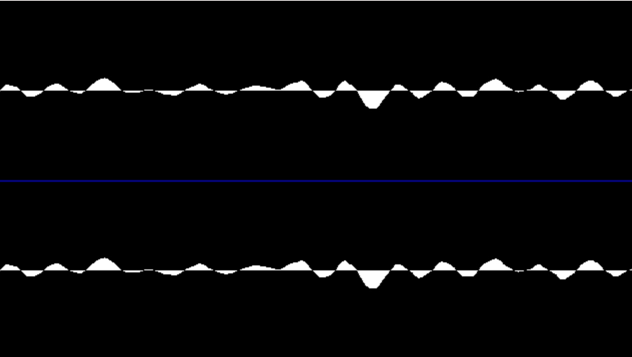
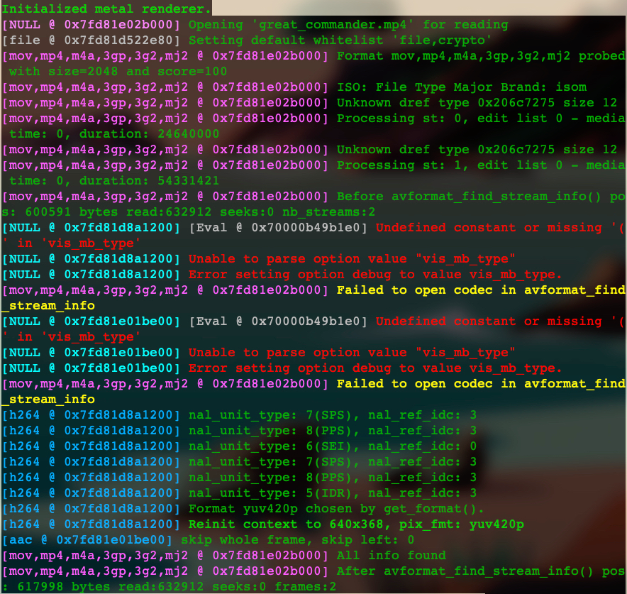

## 2.3.3 ffplay 数据可视化分析应用

1. 播放音频文件时，如果不确定文件的声音是否正常，可以直接使用 ffplay 播放音频文件，播放
的时候会把解码后的音频数据以音频波形的形式显示出来。

   
2. 当播放视频时，想要体验解码器是如何解码每个宏块的，可以使用如下命令：
```shell
ffplay -debug vis_mb_type -ss 10 -t 5 -autoexit foo.mp4
```
如图：

注：宏块显示颜色说明见 表2-10 P58
3. 用 ffplay 查看 B帧预测与 P帧预测信息，想将信息在窗口中显示出来，命令如下：
```shell
ffplay -vismv pf foo.mp4
```
注：pf 是运动向量显示参数，同类其他参数有 bf、bb。可参见 表 2-11 P58   
- 我执行出错了，不知道原因：
```shell
Failed to set value 'pf' for option 'vismv': Option not found
```
4. codecview 参数
第 3 节提到的 -vismv 参数将会在未来被替换掉，未来更多会使用 codecview 这个滤镜来设置。
   命令如下：
```shell
ffplay -flags2 +export_mvs -ss 40 great_commander.mp4 -vf codecview=mv=pf+bf+bb
```   
结果如图（有很多尖头）：
