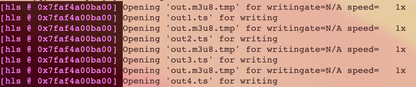

## 3.3.3 FFmpeg 转 HLS 举例

常规的从文件转换 HLS 直播时，使用如下命令：
```shell
ffmpeg -re -i input.mp4 -c copy -f hls -bsf:v h264_mp4toannexb out.m3u8
```
会生成 out.m3u8 文件，和很多切片：


out.m3u8 文件内容会随着切片的产生而更新。可以用如下命令播放这个 HLS 实时流：
```shell
ffplay out.m3u8
```

### 其他参数

生成 HLS 时还有一些参数可以设置：
1. start_number: 设置 M3U8 列表中的第一片的序列数
2. hls_time: 设置 M3U8 列表中切片的 duration
3. hls_list_size: 设置 M3U8 列表中 TS 切片的个数
4. hls_wrap
5. hls_base_url
6. hls_segment_filename 
7. hls_flags 
8. use_localtime
9. method