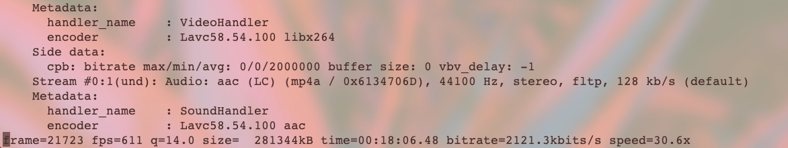
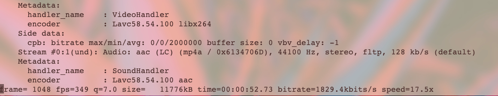

## preset(编码器预设参数)

使用帮助命令，查看 --preset 部分：
```shell
...
 --preset <string>       Use a preset to select encoding settings [medium]
                                  Overridden by user settings.
                                  - ultrafast:
                                    --no-8x8dct --aq-mode 0 --b-adapt 0
                                    --bframes 0 --no-cabac --no-deblock
                                    --no-mbtree --me dia --no-mixed-refs
                                    --partitions none --rc-lookahead 0 --ref 1
                                    --scenecut 0 --subme 0 --trellis 0
                                    --no-weightb --weightp 0
                                  - superfast:
                                    --no-mbtree --me dia --no-mixed-refs
                                    --partitions i8x8,i4x4 --rc-lookahead 0
                                    --ref 1 --subme 1 --trellis 0 --weightp 1
                                  - veryfast:
                                    --no-mixed-refs --rc-lookahead 10
                                    --ref 1 --subme 2 --trellis 0 --weightp 1
                                  - faster:
                                    --no-mixed-refs --rc-lookahead 20
                                    --ref 2 --subme 4 --weightp 1
                                  - fast:
                                    --rc-lookahead 30 --ref 2 --subme 6
                                    --weightp 1
                                  - medium:
                                    Default settings apply.
                                  - slow:
                                    --direct auto --rc-lookahead 50 --ref 5
                                    --subme 8 --trellis 2
                                  - slower:
                                    --b-adapt 2 --direct auto --me umh
                                    --partitions all --rc-lookahead 60
                                    --ref 8 --subme 9 --trellis 2
                                  - veryslow:
                                    --b-adapt 2 --bframes 8 --direct auto
                                    --me umh --merange 24 --partitions all
                                    --ref 16 --subme 10 --trellis 2
                                    --rc-lookahead 60
                                  - placebo:
                                    --bframes 16 --b-adapt 2 --direct auto
                                    --slow-firstpass --no-fast-pskip
                                    --me tesa --merange 24 --partitions all
                                    --rc-lookahead 60 --ref 16 --subme 11
                                    --trellis 2
...
```
参数讲解：
- ultrafast: 最快的编码方式
- superfast: 超级快速...
- veryfast: 非常快速...
- faster: 稍微快速...
- fast: 快速的...
- medium: 折中的...
- slow: 慢的...
- slower: 更慢的...
- veryslow: 非常慢的...
- placebo: 最慢的...

### ultrafast 和 medium 对比
```shell
# ultrafast
ffmpeg -i foo.mp4 -vcodec libx264 -preset ultrafast -b:v 2000k output.mp4

# medium
ffmpeg -i foo.mp4 -vcodec libx264 -preset medium -b:v 2000k output.mp4
```


ultrafast 速度 30.6x；medium 速度 17.5x。但是 medium 转码后画质更好
