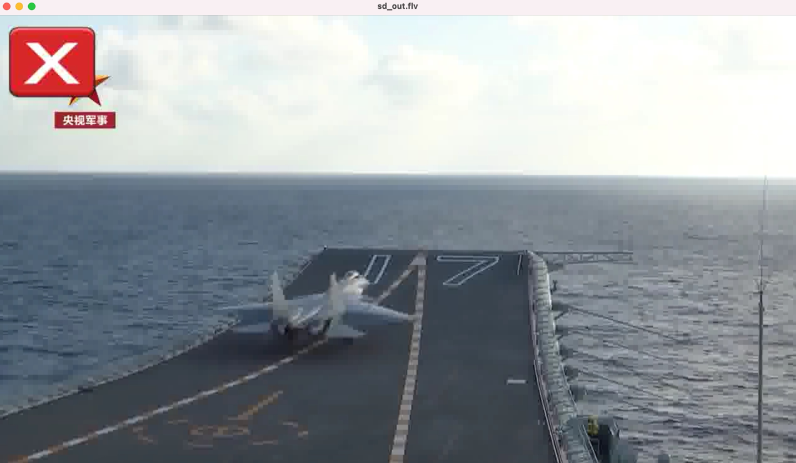

## 6.1 滤镜 Filter 描述格式


### 6.1.1 Filter 的参数排列方式

输入两个文件，一个视频，一个图片，将 logo 进行缩放，然后放视频左上角：
```shell
ffmpeg -i shandong_ship.flv -i ~/Documents/图片/exit.png -filter_complex "[1:v]scale=176:144[logo];[0:v][logo]overlay=x=0:y=0" sd_out.flv
```
参数排列方式：[输入流或标记名] 滤镜参数 [临时标记名];[输入流或标记名] 滤镜参数 [临时标记名]...

加滤镜效果如下：


### 6.1.2 Filter 时间内置变量

- t: 时间戳，以秒为单位，如果输入的时间戳是未知的，则是 NAN
- n: 输入帧的顺序编号，从 0 开始
- pos: 输入帧的位置
- w: 输入视频帧的宽度
- h: 输入视频帧的高度
