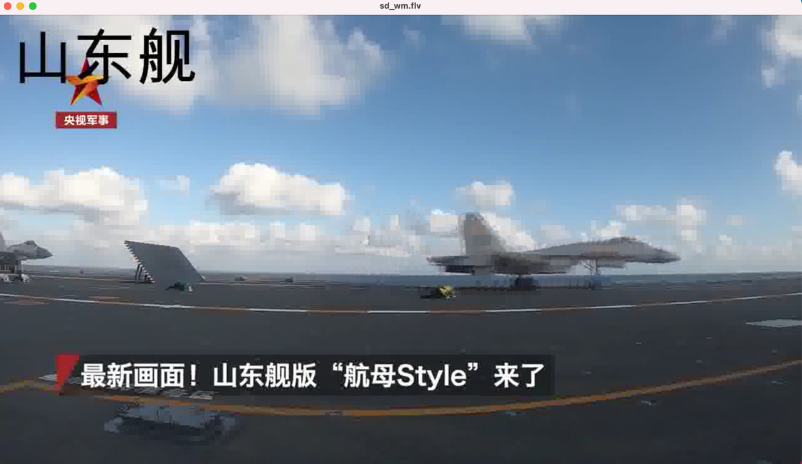
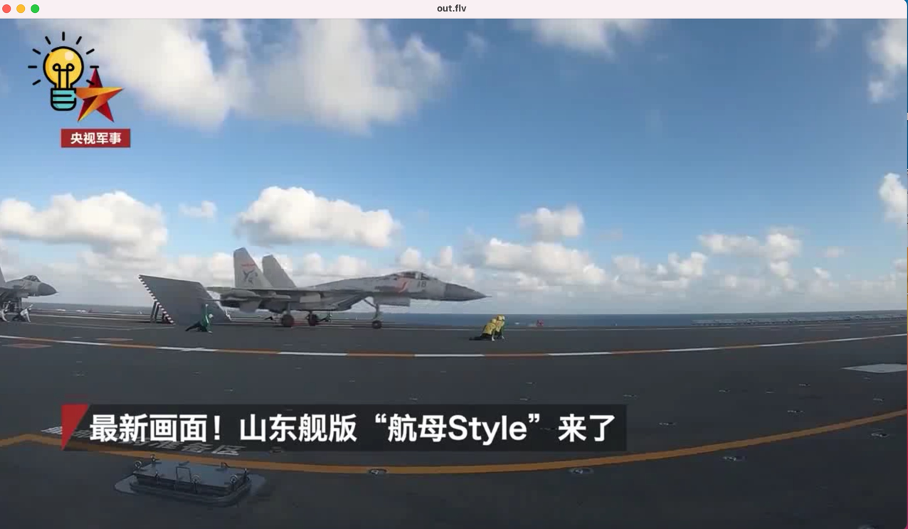
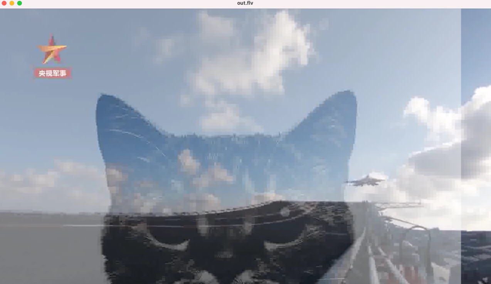

## 6.2 为视频加水印

添加水印可以是文字，也可以是图片。

### 6.2.1 文字水印

在视频中增加文字水印需要准备的条件较多：
1. 要有文字字库处理的相关文件
2. 在编译 FFmpeg 时，需要支持 FreeType、FontConfig、iconv 
3. 系统中需要有相关的字库

**使用 drawtext 滤镜**：   
滤镜参数，见：表 6-2 P183   

在视频左上角添加「山东舰」
```shell
ffmpeg -i shandong_ship.flv -vf "drawtext=fontsize=100:fontfile=FreeSerif.ttf:text='山东舰':x=20:y=20" sd_wm.flv
```
效果如图：

---

### 6.2.2 图片水印

可以向图片添加图片水印、视频跑马灯。图片水印用 **movie** 滤镜。

#### movie 滤镜参数
详细见，表6-3 P187
- filename
- format_name, f
- stream_index, si
- seek_point, sp
- stream, s
- loop
- discontinuity

#### 添加图片水印两种方式：
- 通过 movie 指定水印文件路径
- 通过 filter 读取输入文件的流，并指定为水印

##### 使用 movie 举例：
```shell
ffmpeg -i shandong_ship.flv -vf "movie=/Users/kk/Desktop/lamp.png[wm]; [in][wm]overlay=30:10[out]" out.flv
```
注意，图片路径如果不和视频文件在同一个目录下，要用绝对路径。效果如下：  



也可以加上半透明效果，配合 colorkey 参数：
```shell
# colorkey=颜色:相似度:混合度
ffmpeg -i shandong_ship.flv -vf "movie=/Users/kk/Desktop/kitty.jpeg,colorkey=red:1.0:1.0 [wm]; [in] [wm] overlay=0:0 [out]" out.flv
```
效果如下：  




