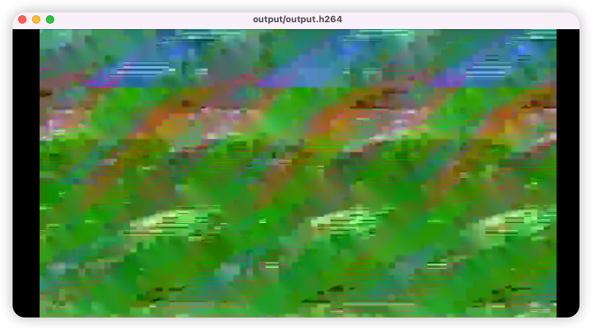

## 视频编码与解码

- [编码](../demo/video_encoder.cpp)

执行代码需要可以测试用的 yuv 文件。从 mp4 文件抽取 yuv 数据如下：
```shell
ffmpeg -i input.mp4 out.yuv
```

编译后，执行在 build.sh 脚本最后面，生成文件 out.h264，然后用 ffplay 播放，没有报错，不过画面不正常，不知道我为什么。

